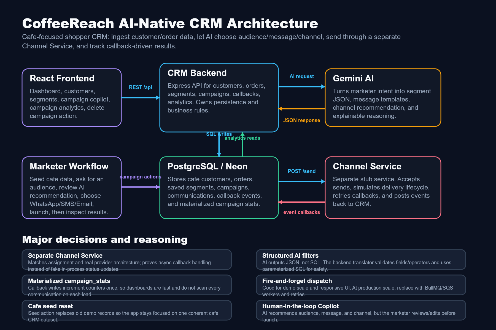

# CoffeeReach (xeno-crm)

## Product intro 
CoffeeReach is a mini CRM for cafe/retail brands that helps marketers decide **who** to target, **what** personalized message to send, and **how** to track outcomes (delivered/opened/clicked/purchased). The core idea is to keep the UI marketer-friendly (goal-based), while the system handles the operational complexity of async delivery events and segmentation under the hood.

Problem: traditional CRMs force users into rigid segmentation filters and don’t model the real-world “delivery receipts” workflow (events arrive later, sometimes out-of-order, sometimes duplicated). CoffeeReach addresses this by making the workflow callback-driven and AI-native: AI converts intent into a safe, executable campaign plan.

---

## Architecture diagram

## Architecture (key decisions + reasoning)
- **Separate services: CRM Backend + Channel Service**
  - The CRM is responsible for customers, segments, campaigns, and ingesting callbacks.
  - The Channel Service simulates a messaging provider (lifecycle events like SENT → DELIVERED → OPENED → READ → CLICKED → PURCHASED).
  - Reasoning: real providers are decoupled systems; modeling this separation forces correct handling of asynchronous, out-of-order, and retry-prone callbacks.

- **Callback-driven event ingestion with idempotency**
  - Every channel callback includes an `idempotency_key`.
  - The CRM stores communication events with a uniqueness constraint and uses conflict handling to prevent duplicate processing.
  - Reasoning: delivery providers retry; the CRM must remain correct even when the same event is received multiple times.

- **Safe AI → SQL boundary (no SQL generated by the model)**
  - The AI produces a structured filter (JSON) representing segmentation intent.
  - A dedicated translator validates fields/operators against an allowlist and generates **parameterized** SQL.
  - Reasoning: keeps security tight—AI output is treated as data, not executable code.

- **Materialized campaign stats**
  - Stats are updated as events arrive (atomic counters per status).
  - Reasoning: dashboards need fast reads; computing aggregates only on demand becomes too slow at scale.

---

## How AI was leveraged / AI-native dev workflow
- **AI-native features in the product**
  - **Segmentation Copilot**: natural-language segmentation → structured filter JSON → validated, parameterized SQL.
  - **Campaign Copilot**: marketer goal → recommended audience + channel + message template + user-facing reasoning.

- **AI used safely and predictably**
  - Prompts explicitly request JSON-only outputs.
  - Outputs are cleaned and parsed deterministically before any DB work.
  - The system rejects/does not execute unsupported filter fields and operators.

- **AI-informed engineering decisions**
  - The “AI-native” part isn’t just calling a model—it’s designing strict contracts between AI outputs and the rest of the system (validation, allowlists, and parameterized queries).

---

## Repo layout
- `packages/crm-backend`: Customers, segments, campaigns, Gemini integration, and callback ingestion.
- `packages/channel-service`: Delivery lifecycle simulator that produces callbacks.
- `packages/frontend`: React UI (dashboard + copilot experiences).

